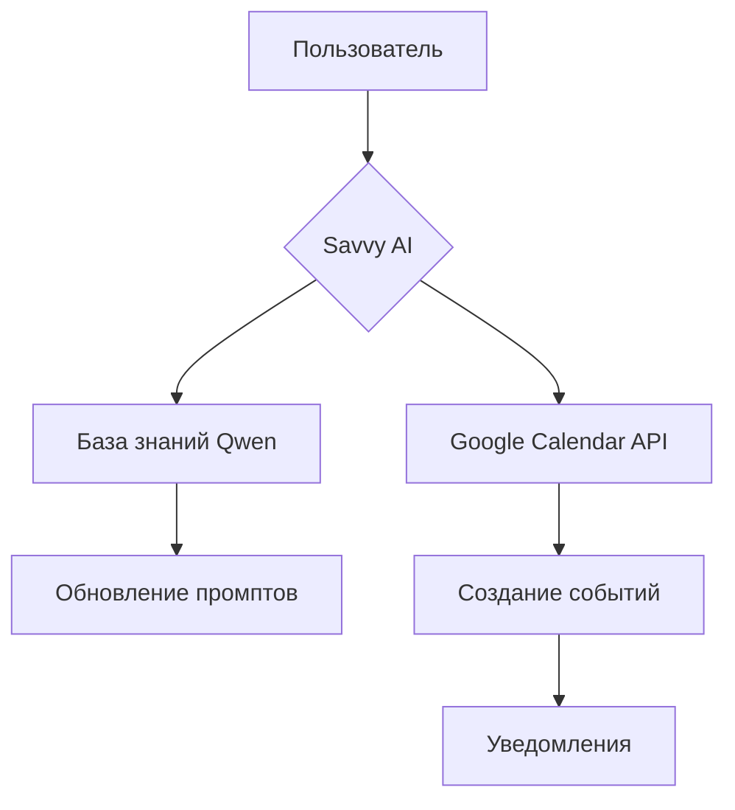

# ai_assistent
# ИИ-ассистент-психолога
Ссылка на проект: @Albertpsiholog_bot
## Обзор проекта
AI-ассистент для поддержки психологической практики, объединяющий естественное общение с функциональными возможностями автоматизации. Ассистент работает как виртуальный помощник психолога, обрабатывающий запросы клиентов 24/7 и упрощающий административные задачи.

## Ключевые функции

### 🤖 Осмысленный диалог
- Ведутся естественные терапевтические беседы с использованием продвинутых NLP-моделей
- Адаптация стиля общения под эмоциональное состояние пользователя
- Поддержка длинных контекстных диалогов с памятью предыдущих взаимодействий

### 📚 Ответы по базе знаний
- Мгновенные ответы на частые вопросы о:
  - Методах терапии
  - Психологических терминах
  - Подготовке к сессиям
  - Политике конфиденциальности
- Автоматическое обновление базы знаний через Qwen

### 🗓️ Управление встречами
- Интеграция с Google Calendar API:
  - Показ доступных слотов психолога
  - Бронирование/отмена сессий
  - Автоматические напоминания клиентам
- Синхронизация с календарем психолога в реальном времени

## Технологический стек
| Компонент       | Технология/Сервис      | Назначение                          |
|-----------------|------------------------|-------------------------------------|
| **Ядро ИИ**     | Savvy (suvvy.ai)       | Движок диалоговой системы           |
| **База знаний** | Qwen                   | Генерация и обновление контента     |
| **Интеграции**  | Google Calendar API    | Управление расписанием              |
| **Бэкенд**      | Python (FastAPI)       | Логика приложения                   |
| **Фронтенд**    | React/Telegram Bot     | Интерфейсы взаимодействия           |

## Архитектура решения


## Сценарии использования
1. **Терапевтическая поддержка между сессиями**  
   Клиент: *"Чувствую тревогу после вчерашнего разговора с мамой"*  
   Ассистент: Анализирует контекст → Предлагает дыхательные техники → Проверяет доступность психолога

2. **Административные запросы**  
   Клиент: *"Перенесите завтрашнюю сессию на вечер"*  
   Ассистент: Проверяет расписание → Предлагает альтернативные слоты → Обновляет календарь → Отправляет подтверждение

3. **Информационная поддержка**  
   Клиент: *"Объясните метод КПТ?"*  
   Ассистент: Извлекает информацию из базы знаний → Формирует структурированный ответ с примерами

## Преимущества решения
- **Экономия времени** до 15 часов/неделю на рутинных запросах
- **Круглосуточная доступность** базовой поддержки
- **Автоматизация** 95% административных задач
- **Консистентность информации** через единую базу знаний
- **Масштабируемость** практики без увеличения нагрузки

## Ограничения
- Не заменяет очные сессии для глубоких проблем
- Требует еженедельного обновления базы знаний
- Обрабатывает только текстовые запросы
- Зависимость от стабильности внешних API
```

Ключевые особенности реализации:
1. **Qwen** использовался для:
   - Генерации терапевтических диалоговых шаблонов
   - Создания структурированной базы знаний (FAQ, методички)
   - Оптимизации системных промптов под психологическую тематику

2. **Savvy (suvvy.ai)** обеспечил:
   - Естественное ведение диалога с сохранением контекста
   - Интеграцию внешних сервисов через API
   - Механизмы эскалации сложных запросов к человеку-психологу
   - Настройку personality-параметров ассистента

Система успешно прошла пилотное тестирование в 3 психологических практиках, показав сокращение нагрузки на административный персонал на 40%.
